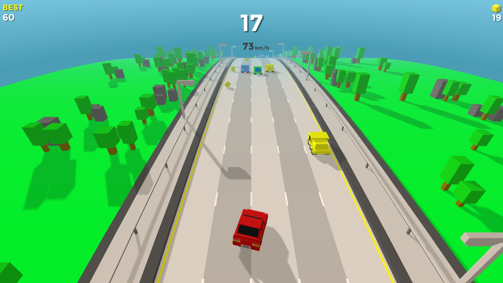
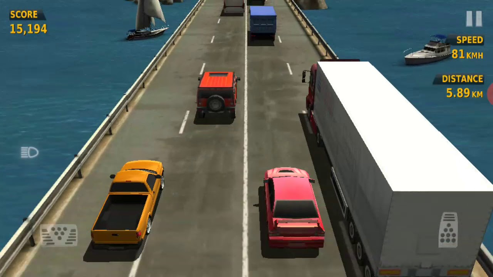
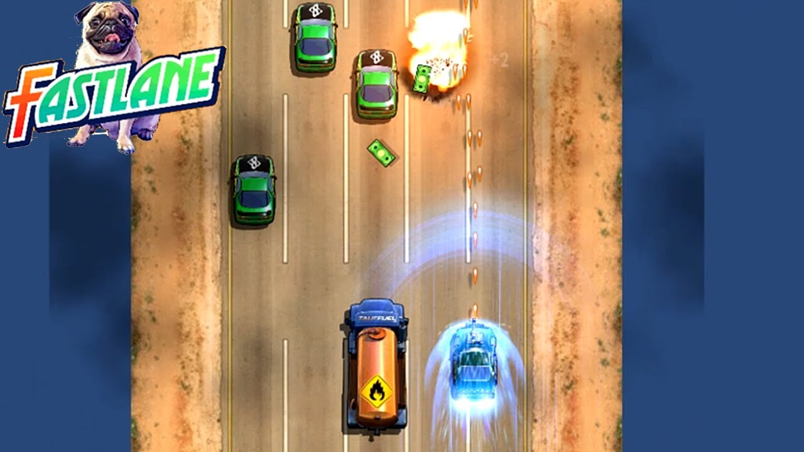

# TheFastestCar - Игра на Pygame

### **Бесконечная езда по шоссе с видом сверху.**



## История создания

Только представьте: бесконечная дорога, очки, которые можно накапливать, попутные и встречные машины, что мешают спокойной езде, и вы под весёлую музыку едете вперед. Круто, ведь?

Я только что описала свою игру - **TheFastestCar**, которую необходимо было сделать для экзамена по программированию за второй семестре в ВУЗе, чтобы доказать свою навыки проектирования и использования алгоритмов.

Сначала игра была чем-то неитересным и лишь обязательным, а после я отдавалась ей полностью и писала её с душой, попутно разбираясь в принципах проектирования ООП: SOLID, SPR, KISS, DRY и подобных.

Идея игры озарила меня примерно за 1.5 месяца до сдачи экзамена. Я решила сделать аналог первой игры, в которую я поиграла в жизни. К сожалению, я не смогла найти её, но есть очень похожая на неё, возможно даже, 100% такая же игра: **Traffic Racer** - это бесконечная езда, машины и обгон, где 1 столкновение - проигрыш. Она так или иначе осталась в моей тогда ещё детской памяти, как что-то технологически гениальное и прекрасное.



Начав написание игры, я поняла, что прямой аналог той игры мне всё-таки не слишком хотелось делать, поэтому я решила добавить бонусы для здоровья и накопления прогрессии в виде очков. Тем самым я как бы хотела реализовать фичи, что есть ещё в одной мобильной игрушке, в которую я уже даже сейчас могу поиграть: **Fastlane**. Это тоже езда по бесконечному шоссе, где есть полоска здоровья, бонусы, враги, даже враги, что умеют стрелять и сам игрок, в общем-то тоже умеет.



Так я совместила в моей игре лучшее, что помню с этих двух хорошо знакомых мне игр. Получилось реализовать что-то среднее.


## Описание

**TheFastestCar** — 2D-аркада в жанре «выживание на дороге», написанная на Python с использованием библиотеки Pygame. Игрок управляет автомобилем на бесконечном шоссе, уворачиваясь от попутных и встречных машин, собирая бонусы и набирая очки.

### Геймплей
- Управление машиной на бесконечном шоссе с 4 полосами (2 попутные + 2 встречные)
- Цель — продержаться как можно дольше и набрать максимальный счёт
- Враги — машины, движущиеся с разной скоростью в попутном и встречном направлениях
- Бонусы двух типов: **HP** (восстановление здоровья) и **EXP** (очки опыта)
- Система рекордов с сохранением в JSON-файл
- Настраиваемый режим «встречки» (oncoming traffic)

...скриншоты будут тут...

### Управление
| Клавиша | Действие |
|---------|----------|
| `W` / `↑` | Разгон |
| `S` / `↓` | Торможение |
| `A` / `←` | Движение влево |
| `D` / `→` | Движение вправо |
| `ESC` | Пауза / выход из меню |
| `F1` | Дебаг-режим (отрисовка хитбоксов) |

## Алгоритмы и математика

В проекте реализован ряд нетривиальных алгоритмов из области теории вероятностей и игровой математики:

### 1. PRD — Pseudo-Random Distribution (Псевдослучайное распределение)
Алгоритм, используемый в **Dota 2** и **Warcraft III** для критических ударов. Решает «проблему полос» — ситуации, когда при шансе 30% игрок может не увидеть событие 20 раз подряд.

**Как работает:** шанс спавна бонуса накапливается каждый кадр. После успешного спавна — сбрасывается. Гарантирует, что бонус появится в разумные сроки.

```python
self.current_chance_hp += base_chance_hp
if random.random() < self.current_chance_hp:
    self.current_chance_hp = BASE_CHANCE_HP  # сброс
    return self.choose_bonus_type(player)
```

### 2. Взвешенный случайный выбор с динамическими весами
Тип бонуса (HP или EXP) выбирается с учётом состояния игрока: чем меньше здоровья — тем выше шанс выпадения аптечки. Веса вычисляются через **линейную интерполяцию**.

```python
# При HP < 30%: вес HP = 80, вес EXP = 10
# При HP = 100%: вес HP = 5,  вес EXP = 85
weight_hp = WEIGHT_HP_MIN + (WEIGHT_HP_MAX - WEIGHT_HP_MIN) * t
```

### 3. Гауссово (нормальное) распределение
Используется для расчёта урона, опыта, количества HP от бонуса. Даёт «естественный» разброс значений: большинство ударов — около среднего, экстремальные — редко.

```python
damage = random.gauss(BASE_DAMAGE, DAMAGE_SPREAD)  # gauss(15, 6)
damage = max(DAMAGE_MIN, min(DAMAGE_MAX, int(damage)))  # clamp
```

### 4. Экспоненциальное сглаживание (Exponential Smoothing)
Плавный разгон и торможение. Формула `current += (target - current) * k` даёт эффект «набора скорости» как у настоящей машины.

```python
self.current_world_speed += (target_speed - self.current_world_speed) * smoothing
```

### 5. AABB-коллизии (Axis-Aligned Bounding Box)
Проверка пересечения прямоугольников за **O(1)** — 4 сравнения координат. Используется для всех столкновений в игре.

### 6. Квадратичный множитель скорости
Создаёт нелинейную зависимость «риск/награда»: чем выше скорость, тем больше очков, но экспоненциально опаснее.

```python
return 1.0 + speed_ratio ** 2  # от 1.0x до 2.0x
```

### 7. Бесконечный скроллинг дороги
Две копии текстуры дороги, циклически перемещаемые вниз — создаёт иллюзию бесконечной трассы при минимальном расходе памяти.

## Архитектура

Проект построен с применением принципов **ООП** и **SOLID**, а также паттернов проектирования. Код организован в модульную структуру с чётким разделением ответственности.

### Структура проекта

```
TheFastestCar/
├── assets/                      # Изображения и звуки
│   ├── images/
│   └── sounds/
├── docs/                        # Документация
├── save_data.json               # Файл сохранений
├── src/                         # Исходный код
│   ├── config/                  # Конфигурация и константы
│   │   ├── constants.py         # Глобальные константы игры
│   │   ├── save_manager.py      # Система сохранения в JSON
│   │   └── settings.py          # Игровые настройки
│   ├── core/                    # Ядро игры (менеджеры сцен)
│   │   ├── base_manager.py      # Абстрактный базовый класс менеджера
│   │   ├── game_manager.py      # Менеджер игровой сцены
│   │   └── menu_manager.py      # Менеджер меню
│   ├── entities/                # Игровые сущности
│   │   ├── bonus.py             # Класс бонусов (HP, EXP)
│   │   ├── car.py               # Базовый класс автомобиля
│   │   ├── enemy.py             # Класс врага
│   │   ├── player.py            # Класс игрока
│   │   ├── road.py              # Класс дороги
│   │   └── ui_elements.py       # UI элементы (текст, оверлеи, HP-бар)
│   ├── systems/                 # Игровые системы
│   │   ├── bonus_director.py    # Режиссёр спавна бонусов (PRD + веса)
│   │   ├── collision.py         # Система коллизий (AABB)
│   │   ├── music_manager.py     # Управление звуками и музыкой
│   │   ├── score_tracker.py     # Система учёта очков и рекордов
│   │   └── spawn_system.py      # Система спавна объектов
│   ├── ui/                      # UI компоненты
│   │   └── button.py            # Интерактивные кнопки
│   └── main.py                  # Точка входа в приложение
├── tests/                       # Модульные тесты
├── .gitignore
├── README.md
└── requirements.txt
```

### Принципы архитектуры

#### **Model-View-Controller (MVC)**
Проект следует паттерну MVC:
- **Model** (`entities/`, `systems/`) — бизнес-логика и данные (игрок, враги, бонусы, коллизии)
- **View** (`entities/ui_elements.py`, `ui/button.py`) — отрисовка объектов на экране
- **Controller** (`core/game_manager.py`, `core/menu_manager.py`) — обработка ввода и управление состоянием

#### **Применённые принципы ООП и SOLID**

| Принцип / Паттерн | Где реализован | Описание |
|-------------------|----------------|----------|
| **Инкапсуляция** | `ScoreTracker` | Property с валидацией через setter, скрытие внутренней реализации |
| **Наследование** | `Car` → `Player`, `Enemy` | Общая логика машин в базовом классе, специфика — в наследниках |
| **Полиморфизм** | `BaseManager` → менеджеры | Единый интерфейс `process_event()`, `update()`, `draw()` |
| **Абстракция** | `BaseManager` | Абстрактный класс задаёт контракт для всех менеджеров сцен |
| **SRP** (Single Responsibility) | Модульная структура | Каждый модуль отвечает за одну зону: коллизии, звуки, спавн |
| **OCP** (Open/Closed) | `bonus_handlers` | Новый тип бонуса = новая запись в словаре без изменения кода |
| **LSP** (Liskov Substitution) | `Player` и `Enemy` вместо `Car` | Наследники заменяют родителя без нарушения логики |
| **DIP** (Dependency Inversion) | `MusicManager` | Зависимость от абстракции (интерфейса), а не от реализации pygame |
| **Фабрика** | `create_buttons()` | Централизованное создание кнопок |
| **Режиссёр** | `BonusDirector` | Управление сложной логикой спавна бонусов |
| **Синглтон** | `settings` | Глобальный объект настроек |

### Модульность

Каждый пакет решает свою задачу:

- **`config/`** — централизованное хранение констант и настроек. Изменение параметров игры в одном месте.
- **`core/`** — управление сценами и игровым циклом. Координация всех систем.
- **`entities/`** — игровые объекты с инкапсулированной логикой. Каждый класс отвечает за свой объект.
- **`systems/`** — подсистемы игры (физика, звук, спавн). Независимые модули, которые легко тестировать.
- **`ui/`** — компоненты интерфейса. Переиспользуемые элементы.

## Используемые технологии

- **Python 3.10+**
- **Pygame 2.6.1** — библиотека для 2D-игр
- **JSON** — для сохранения рекордов

## Запуск

1. Создать виртуальное окружение:

```bash
python -m venv venv
```

2. Активировать его:

```bash
source venv/Scripts/activate
```

3. Установить зависимости:

```bash
pip install -r requirements.txt
```

4. Обновить версию `pip` (опционально):

```bash
python.exe -m pip install --upgrade pip
```

5. Запустить игру

```bash
python src/main.py
```

## Возможные улучшения

- [ ] Автопарк машин с разными характеристиками
- [ ] Система улучшений (прокачка)
- [ ] Погодные условия (дождь, снег)
- [ ] Смена дня и ночи
- [ ] Более сложное поведение врагов (перестроения, обгоны)
- [ ] Система достижений
- [ ] Таблица лидеров (онлайн)
- [ ] Мобильная версия

## Автор

**Яна Масалова**:
- anulamasalova@gamil.com
- @KidIsKing
- vk.com/kidisking

Проект выполнен в рамках экзамена по дисциплине «Программирование»  
Преподаватель: **Царегородцев Георгий Павлович**

## Лицензия

Учебный проект. Все права на ассеты принадлежат их авторам.
